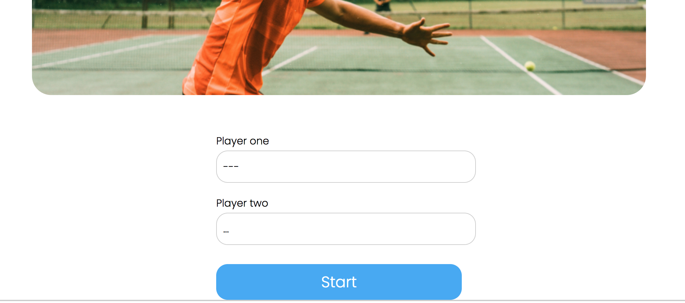
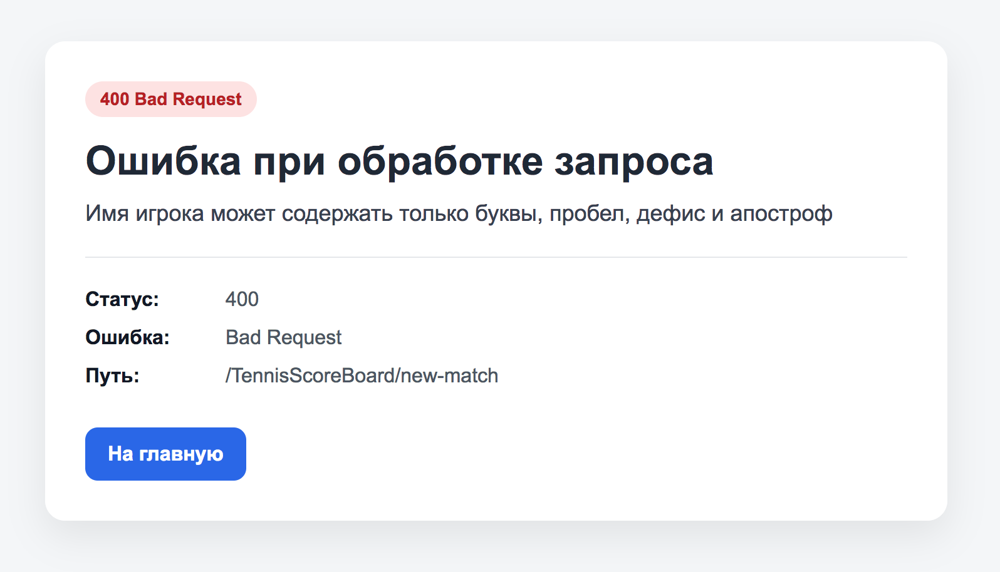
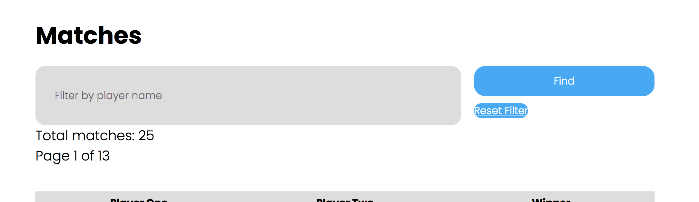
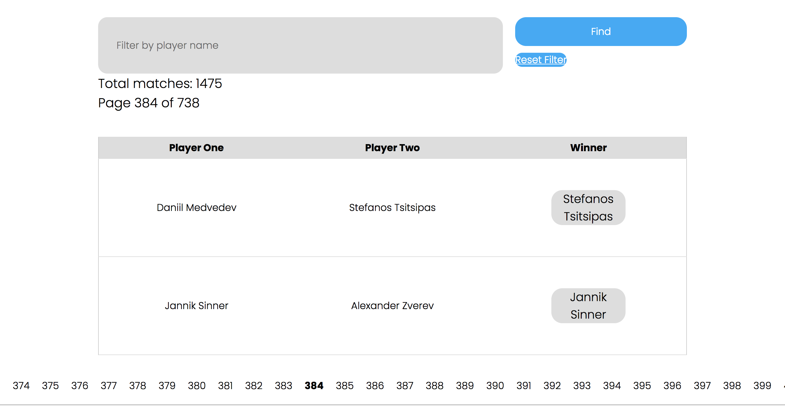
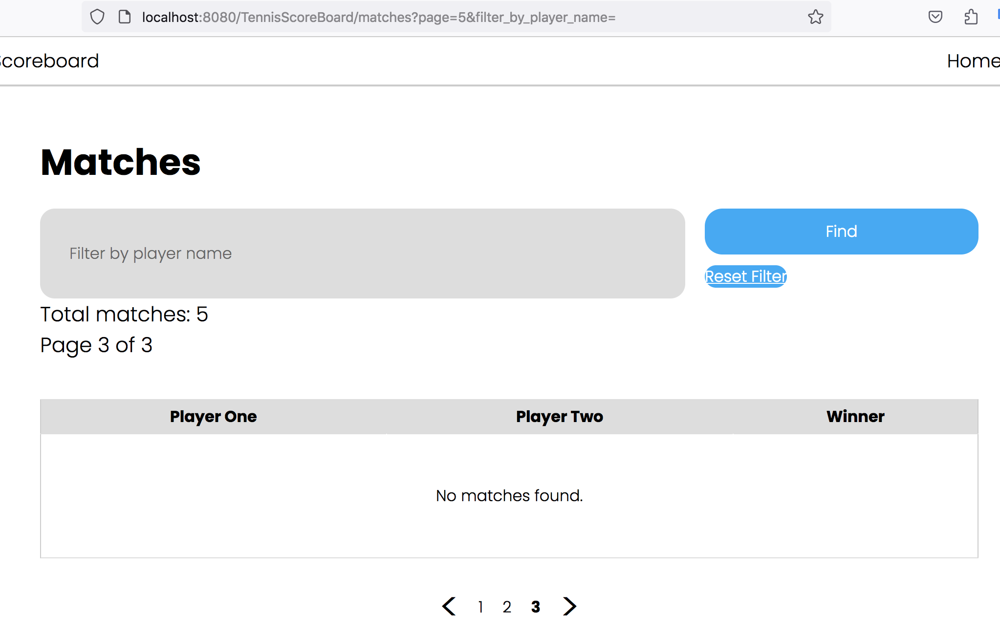

# Сводный отчёт по код-ревью проекта `tennis-scoreboard`

# Review на реализацию от [@LinkerMA](https://github.com/LinkerMak/TennisScoreBoard) проекта [Табло теннисного матча](https://zhukovsd.github.io/java-backend-learning-course/projects/tennis-scoreboard/)

> Ревью выполнено в формате fork-а репозитория и добавления комментариев 'In-Situ' и обучающих заметок в формате markdown.

К классам и файлам конфигурации добавлены подробные комментарии. 

Там же есть ссылки на файлы, объясняющие некоторые особо значимые темы. 

Сами файлы с заметками находятся в одном пакете с классами, к которым относится тема заметки.

```
В `TODO`-комментариях️ описаны критически важные замечания, а также места нарушения ТЗ.
```

Список всех `TODO`-комментариев сгруппированных по пакетам и классам можно посмотреть в Idea через меню: `View` -> `Tool Windows` -> `TODO`

Читать стоит в таком порядке:

1. В файле `1-functional-overview.md` описан функциональный обзор приложения.

2. В файле `2-refactoring-roadmap.md` находится план работы над исправлениями.

- В файле `Common.md` описаны замечания, относящиеся ко всему проекту или нескольким его частям. (можно читать в любое время)

- В файле `Pluses.md` описаны наиболее значимые плюсы. (можно читать в любое время)

- В файле `Conclusion.md` находится заключение. (можно читать в любое время)

```text
Знаком ❗️ помечены критически важные замечания, а также места нарушения ТЗ.
```

## Функциональный обзор

- ❗️При ошибке валидации имени сообщение показывается на отдельной странице





После этого пользователю приходится возвращаться на главную страницу и только потом пытаться заново создать матч. Лучше чтобы сообщение показывалось прямо на странице создания матча.

- Кнопка сброса фильтра расположена под кнопкой поиска и имеет проблемы с размером.



- Когда фильтр по имени не применён, можно не показывать кнопку сброса фильтра

- ❗️В пагинации на странице завершённых матчей отображаются все страницы, что плохо выглядит при большом количестве страниц и делает недоступными страницы за пределами экрана.



Лучше сделать отображение текущей и +-2 страниц вокруг неё.

- При передаче номера страницы, большего, чем общее число страниц, показывается последняя реально существующая страница, но на ней не отображаются матчи.



## Конфигурационные файлы

### pom.xml

Комментарии из файлов конфигурации лучше удалять перед коммитом.
```xml
<!-- Комментарии из файлов конфигурации лучше удалять перед коммитом -->
```
***

В зависимостях этой версии обнаружены уязвимости — стоит использовать более свежую версию.
```xml
<spring.version>6.2.5</spring.version> <!-- В зависимостях этой версии обнаружены уязвимости — стоит использовать более свежую версию -->
```
***

Версии других зависимостей (особенно повторяющиеся) тоже лучше вынести в properties.
```xml
<!-- Версии других зависимостей (особенно повторяющиеся) тоже лучше вынести в properties -->
```
***

## tennis.score.board.config

### PersistenceConfiguration

Здесь можно сканировать только "tennis.score.board.service", "tennis.score.board.repository", "tennis.score.board.web.mapper".
```java
@ComponentScan("tennis.score.board")
```
***

Все повторяющиеся или важные строковые литералы лучше выносить в `private static final` константы с понятными именами. Именованная константа делает код более семантически понятным.
```java
private final Environment env;
```
***

Если у класса есть ровно один конструктор, Spring автоматически использует его для внедрения зависимостей — даже без @Autowired. Можно удалить конструктор и поставить над классом @RequiredArgsConstructor.
```java
@Autowired
public PersistenceConfiguration(Environment env) {
    this.env = env;
}
```
***

Можно внедрять бин DataSource как параметр метода. Spring автоматически найдёт бин типа DataSource (созданный методом dataSource()) и передаст его в entityManagerFactory при вызове.
```java
@Bean
public LocalContainerEntityManagerFactoryBean entityManagerFactory() {
    // ...
    factory.setDataSource(dataSource());
    // ...
}
```
***

Для устранения дублирования при добавлении каждого опционального свойства можно создать вспомогательный метод addPropertyIfPresent.
```java
private Properties hibernateProperties() {
    Properties properties = new Properties();
    // ...
}
```
***

### WebMvcConfiguration

@EnableScheduling можно вынести в отдельный класс (даже если он будет пустой), чтобы отделить управление задачами от веб-слоя.
```java
@EnableScheduling
```
***

Здесь можно сканировать только "tennis.score.board.web.controller".
```java
@ComponentScan("tennis.score.board")
```
***

Если у класса есть ровно один конструктор, Spring автоматически использует его для внедрения зависимостей — даже без @Autowired. Можно удалить конструктор и поставить над классом @RequiredArgsConstructor.
```java
@Autowired
public WebMvcConfiguration(ApplicationContext applicationContext) {
    this.applicationContext = applicationContext;
}
```
***

Можно использовать StandardCharsets.UTF_8.name().
```java
templateResolver.setCharacterEncoding("UTF-8");
```
***

Можно использовать StandardCharsets.UTF_8.name().
```java
resolver.setCharacterEncoding("UTF-8");
```
***

### WebMvcDispatcherServletInitializer

Здесь можно добавить загрузку PersistenceConfiguration.class.
```java
return new Class[0];
```
***

Можно использовать StandardCharsets.UTF_8.name().
```java
characterEncodingFilter.setEncoding("UTF-8");
```
***

## tennis.score.board.exception

### PlayerNotInMatchException

Сообщения в исключениях принято писать на английском языке. Опечатка учавствует —> участвует.
```java
super("Игрок с id " + id.toString() + " не учавствует в матче");
```
***

## tennis.score.board.model.entity

### Использование зарезервированных слов в качестве названий в БД

Использование зарезервированного слова (например, `USER`, `ORDER`, `GROUP`) в качестве названия таблицы в базе данных — это плохая практика, которая может привести к ряду проблем.

Вот основные из них:

### 1. Синтаксические ошибки

Это самая главная и частая проблема. SQL-парсер видит зарезервированное слово и ожидает определённой синтаксической конструкции, а не названия таблицы.

**Пример:**
При попытке получить все записи из таблицы с названием `ORDER`.
```sql
SELECT * FROM ORDER;
```
этот запрос, скорее всего, вызовет ошибку, потому что `ORDER` — это ключевое слово для `ORDER BY` (сортировка). Парсер будет ожидать после него `BY` и не поймёт, что `ORDER` — это название таблицы.

### 2. Необходимость экранирования (Quoting)

Чтобы обойти синтаксические ошибки, придётся постоянно заключать название таблицы в специальные кавычки, которые зависят от конкретной СУБД:

* **MySQL / MariaDB:** обратные кавычки (`` ` ``)
    ```sql
    SELECT * FROM `ORDER`;
    ```
* **PostgreSQL / Стандарт SQL:** двойные кавычки (`" "`)
    ```sql
    SELECT * FROM "ORDER";
    ```
* **SQL Server:** квадратные скобки (`[ ]`)
    ```sql
    SELECT * FROM [ORDER];
    ```

### 3. Снижение читаемости и усложнение кода

Из-за необходимости постоянного экранирования код становится менее читаемым. Разработчики могут легко забыть поставить кавычки, что приведёт к ошибкам, на поиск которых уйдёт время.

### 4. Проблемы с ORM и другими инструментами

Инструменты, которые автоматически генерируют SQL-запросы (например, Hibernate, JPA, SQLAlchemy и другие ORM), а также различные GUI-клиенты и утилиты для миграции, могут не справиться с такими названиями. Они могут не знать, что `ORDER` нужно экранировать, и будут генерировать нерабочий SQL-код. Это потребует дополнительной конфигурации или ручного вмешательства.

### 5. Потеря переносимости

Ключевые слова могут отличаться в разных СУБД. Слово, которое не зарезервировано в одной системе, может быть зарезервировано в другой. Если команда сменит СУБД, проект с такими названиями таблиц потребует значительной доработки.

---

**Лучшая практика:**

**Никогда не использовать зарезервированные слова для названий таблиц, столбцов и других объектов в БД.**

Всегда проверять список зарезервированных слов для основных СУБД. Чтобы избежать случайных совпадений, можно придерживаться соглашений об именовании, например:
* Использовать префиксы: `tbl_order`.
* Использовать множественное число (если слово во множественном числе не зарезервировано): `orders` (слово `orders` не зарезервировано).
* Добавлять суффиксы: `order_data`.

### Match

"Match" (с таким именем сейчас создаётся таблица для завершённых матчей) является зарезервированным словом в некоторых СУБД. Здесь проблем не будет, но лучше не выбирать такие названия. (см. файл "sql-keywords.md" в этом же пакете).
```java
public class Match {
```
***

## tennis.score.board.model.matchstate

### MatchState

Класс хранит ссылки на JPA-сущности (`Player`). Использование объектов JPA Entity в доменной логике создаёт прямую зависимость доменного слоя от слоя персистентности (долговременного хранения данных) и смешивает слои приложения, что нарушает чистоту архитектуры. Это может привести к проблемам с ленивой загрузкой (`LazyInitializationException`) или к неожиданным изменениям в базе данных, если состояние `Player` будет изменено в ходе бизнес-логики. Доменные модели должны оперировать другими доменными моделями, а не сущностями, привязанными к базе данных.
```java
@Getter
private final Player player1;
@Getter
private final Player player2;
```
***

Нет проверки на то, что матч не завершён. Попытка начислить очко в уже завершённом матче — это не нормальная ситуация и должна приводить к исключению.
```java
public void updateScore(WinnerSide winnerSide) {
    matchScore.pointWonBy(winnerSide);
}
```
***

Вместо того чтобы разбирать MatchScoreSnapshot по частям, можно передать в ScoreboardSnapshot его целиком.
```java
return new ScoreboardSnapshot(
        player1.getId(),
        player2.getId(),
        // ...
);
```
***

### ScoreboardSnapshot

Для счёта в гейме, сете и матче уже есть специальные GameScoreSnapshot, SetScoreSnapshot, MatchScoreSnapshot поэтому здесь можно использовать эти объекты.
```java
public record ScoreboardSnapshot(
        Long player1Id,
        Long player2Id,
        // ...
) {
}
```
***

### WinnerSide

Возможно, больше подошло бы название TennisSide или ScoreSide со значениями FIRST и SECOND.
```java
PLAYER_1,
PLAYER_2
```
***

## tennis.score.board.model.matchstate.game

# Принцип разделения команд и запросов (Command-Query Separation)

В мире объектно-ориентированного программирования существует множество принципов, призванных сделать код более чистым, предсказуемым и поддерживаемым. Один из таких фундаментальных, но часто упускаемых из виду принципов — это **Command-Query Separation (CQS)**, или Принцип разделения команд и запросов.

Суть принципа проста:

> Каждый метод должен быть либо **командой**, выполняющей действие, либо **запросом**, возвращающим данные, но не тем и другим одновременно.

Иными словами, нельзя смешивать в одном методе изменение состояния системы и получение данных о ней. Метод должен либо менять мир, либо рассказывать о нем, но не делать и то и другое сразу.

## Что такое "Команда" (Command)?

**Команда** — это метод, который изменяет состояние объекта или системы. Его также называют **модификатором (modifier)** или **мутатором (mutator)**.

*   **Основная задача:** Вызвать побочный эффект (side effect), то есть изменить данные.
*   **Возвращаемое значение:** В идеале, команды должны возвращать `void`. Они говорят "я сделал дело", но не отчитываются о деталях. Допустимым исключением считается возвращение `this` для организации "цепочек вызовов" (method chaining).
*   **Именование:** Имена команд — это, как правило, глаголы в повелительном наклонении: `save()`, `updateUser()`, `calculateTotal()`, `sendEmail()`.

#### Пример:
```java
class BankAccount {
    private double balance;

    // Это команда. Она меняет состояние, но ничего не возвращает.
    public void deposit(double amount) {
        if (amount > 0) {
            this.balance += amount;
        }
    }
}
```

## Что такое "Запрос" (Query)?

**Запрос** — это метод, который возвращает информацию о состоянии объекта или системы, не изменяя это состояние.

*   **Основная задача:** Предоставить данные вызывающему коду.
*   **Побочные эффекты:** Запросы не должны иметь видимых побочных эффектов. Вызов запроса не должен менять то, что вернет этот же запрос при повторном вызове (если между вызовами не было команд).
*   **Возвращаемое значение:** Запросы всегда имеют возвращаемый тип, отличный от `void`.
*   **Именование:** Имена запросов — это часто существительные или глаголы с префиксами `get`, `is`, `has`: `getBalance()`, `getUsers()`, `isActive()`, `hasPermissions()`.

#### Пример:
```java
class BankAccount {
    private double balance;

    // Это запрос. Он возвращает данные, не меняя состояние.
    public double getBalance() {
        return this.balance;
    }
}
```

## Почему нарушение CQS — это проблема?

Когда метод одновременно является и командой, и запросом, это приводит к ряду проблем:

1.  **Неожиданные побочные эффекты:** Главная опасность. Разработчик вызывает метод, думая, что просто получает данные, но при этом незаметно меняет состояние системы. Это порождает трудноуловимые баги.
    *   *Пример:* `if (user.promoteToAdminAndCheckStatus()) { ... }`. Внутри условия `if` пользователь внезапно получает права администратора.
2.  **Снижение читаемости кода:** Намерение программиста становится неясным. Глядя на код, сложно понять, происходит ли в данной строке изменение данных или только их чтение.
3.  **Сложность тестирования:** Методы, которые делают несколько вещей сразу, сложнее тестировать. Приходится проверять и возвращаемое значение, и изменение состояния объекта.
4.  **Проблемы с кэшированием:** Результаты "чистых" запросов можно безопасно кэшировать. Если же запрос имеет побочные эффекты, его результат кэшировать нельзя.

## Пример нарушения и его исправление

**Плохо (нарушение CQS):**
```java
class Document {
    private int pageCounter = 0;

    // Этот метод и возвращает номер, и увеличивает счетчик.
    public int getNextPageNumber() {
        this.pageCounter++;
        return this.pageCounter;
    }
}
// Вызов doc.getNextPageNumber() дважды вернет разные значения.
```

**Хорошо (соблюдение CQS):**
```java
class Document {
    private int pageCounter = 0;

    // Запрос: просто возвращает текущий номер страницы.
    public int getCurrentPageNumber() {
        return this.pageCounter;
    }

    // Команда: переходит к следующей странице.
    public void advanceToNextPage() {
        this.pageCounter++;
    }
}
```
Такой код предсказуем, понятен и надежен.

## Исключения, подтверждающие правило

CQS — это мощный принцип, но не догма. Существуют общепринятые исключения. Классический пример — метод `pop()` в структуре данных "стек". Он изменяет стек (команда) и возвращает удаленный элемент (запрос). Такое поведение является устоявшимся соглашением, оно ожидаемо и не вызывает путаницы.

## Заключение

Принцип разделения команд и запросов — это простой, но мощный инструмент в арсенале разработчика. Приучив себя при проектировании методов задавать вопрос "это команда или запрос?", вы начнете создавать более предсказуемый, тестируемый и поддерживаемый код. Эта дисциплина мышления — один из ключевых шагов на пути к написанию по-настоящему профессионального программного обеспечения.

### GameResult

Больше подошло бы название GameState.
```java
public enum GameResult {
```
***

Существование этого класса способствует нарушению Принципа разделения команд и запросов (см. файл "cqs-principle.md" в этом же пакете). Для проверки, завершён ли гейм/тай-брейк можно создать метод boolean isFinished() и вызывать его после начисления очка.
```java
CONTINUES,
TRANSITION_TO_DEUCE,
FINISHED
```
***

По своей сути значение TRANSITION_TO_DEUCE является конкретизацией состояния CONTINUES, но сейчас они находятся на одном уровне абстракции. Было бы более логичным, если бы между ними была иерархия, где TRANSITION_TO_DEUCE часть CONTINUES. В текущем проекте реализовывать подобную структуру избыточно, и после рефакторинга слоя доменных моделей, скорее всего, этот класс исчезнет.
```java
TRANSITION_TO_DEUCE,
```
***

### GameScore

Метод нарушает Принцип разделения команд и запросов (см. файл "cqs-principle.md" в этом же пакете).
```java
GameResult pointWonBy(WinnerSide winnerSide);
```
***

### DeuceGameScore

В существовании этого класса нет необходимости — он забирает часть ответственности у RegularGameScore, что размазывает цельную логику по нескольким классам.
```java
public class DeuceGameScore implements GameScore {
```
***

Логика методов handleAdvantage_P1 и handleAdvantage_P2 полностью дублируется для резных игроков. Стоит придумать, как избавиться от дублирования.
```java
private GameResult handleAdvantage_P1(WinnerSide winnerSide) {
    // ...
}
```
***

Отсутствует явное указание модификатора доступа.
```java
DeucePoints pointsState = DeucePoints.DEUCE;
```
***

Опечатка handleDueceState —> handleDeuceState.
```java
private GameResult handleDueceState(WinnerSide winnerSide) {
```
***

В java принято именовать методы в стиле camelCase: handleAdvantageP1.
```java
private GameResult handleAdvantage_P1(WinnerSide winnerSide) {
```
***

Когда из блока if происходит return, то следующий код можно писать без else.
```java
else {
    pointsState = DeucePoints.DEUCE;
    return GameResult.CONTINUES;
}
```
***

В java принято именовать методы в стиле camelCase: handleAdvantageP2.
```java
private GameResult handleAdvantage_P2(WinnerSide winnerSide) {
```
***

Когда из блока if происходит return, то следующий код можно писать без else.
```java
else {
    pointsState = DeucePoints.DEUCE;
    return GameResult.CONTINUES;
}
```
***

Сообщения в исключениях принято писать на английском языке.
```java
case DEUCE -> throw new IllegalStateException("Не удалось определить победителя деюса");
```
***

### DeucePoints

Выделять в отдельную абстракцию счёт для режима больше-меньше — избыточно. Значение 40 уже есть в Points и там же уместно разместить значение для "AD".
```java
DEUCE("40", "40"),
ADVANTAGE_P1("AD", "40"),
ADVANTAGE_P2("40", "AD");
```
***

Отсутствует явное указание модификатора доступа.
```java
String getDisplayValuePlayer1() {
```
***

Отсутствует явное указание модификатора доступа.
```java
String getDisplayValuePlayer2() {
```
***

### Points

В реальном теннисном гейме также есть значение ADVANTAGE, обозначающее преимущество.
```java
LOVE(0, "0"),
FIFTEEN(1, "15"),
THIRTY(2, "30"),
FORTY(3, "40"),
WIN_POINT(4, "");
```
***

В реальном теннисном гейме нет счёта с таким значением.
```java
WIN_POINT(4, "");
```
***

Поле int rank кодирует значения enum (и предметной области), что лишает смысла от использования перечисления.
```java
private final int rank;
```
***

Сообщения в исключениях принято писать на английском языке.
```java
case WIN_POINT -> throw new IllegalStateException("Нельзя вызывать next() для WIN_POINT");
```
***

Доменная модель не должна знать то, как она отображается во View — это нарушает Принцип единой ответственности (SRP). В идеале эта логика должна быть в маппере.
```java
public String displayValue() {
```
***

Сообщения в исключениях принято писать на английском языке.
```java
throw new IllegalStateException("Нельзя вызывать displayValue() для WIN_POINT");
```
***

### RegularGameScore

"Кодирование" счёта. Использование поля int rank из Points лишает смысла само существование перечисления. Логика обработки счёта в гейме должна полагаться на значения констант enum, а не на их условный порядковый номер.
```java
private Points player1Points = Points.LOVE;
private Points player2Points = Points.LOVE;
```
***

Константы объявляются первыми (пишутся в самом верху) в классе.
```java
private static final int REQUIRED_LEAD = 2;
```
***

Нет проверки на то, что гейм не завершён. Попытка начислить очко в уже завершённом гейме — это не нормальная ситуация и должна приводить к исключению.
```java
public GameResult pointWonBy(WinnerSide winnerSide) {
```
***

В java принято называть методы глаголами: например, determineGameResult.
```java
private GameResult gameResult() {
```
***

Когда из блока if происходит return, то следующую ветку можно писать без else.
```java
else if(isDeuce()) {
```
***

Когда из блока if происходит return, то следующую ветку можно писать без else.
```java
else if(player2Points == Points.WIN_POINT && pointsLeadOfPlayer2() >= REQUIRED_LEAD) {
```
***

### TieBreakGameScore

Префикс TIE_BREAK можно удалить — этот контекст понятен из названия класса.
```java
private static final int TIE_BREAK_MIN_POINTS_TO_WIN = 7;
```
***

Нет проверки на то, что тай-брейк не завершён. Попытка начислить очко в уже завершённом тай-брейке — это не нормальная ситуация и должна приводить к исключению.
```java
public GameResult pointWonBy(WinnerSide winnerSide) {
```
***

В java методы принято называть глаголами, а возвращающие boolean — в стиле вопросительного предложения: например, isTieBreakMinPointsCondition.
```java
private boolean tieBreakMinPointsCondition() {
```
***

В java методы принято называть глаголами, а возвращающие boolean — в стиле вопросительного предложения: например, isTieBreakLeadCondition.
```java
private boolean tieBreakLeadCondition() {
```
***

В java принято называть методы глаголами: например, getPointsLeadOfPlayer1.
```java
private int pointsLeadOfPlayer1() {
```
***

В java принято называть методы глаголами: например, getPointsLeadOfPlayer2.
```java
private int pointsLeadOfPlayer2() {
```
***

Когда из блока if происходит return, то следующую ветку можно писать без else. Сообщения в исключениях принято писать на английском языке.
```java
else throw new IllegalStateException("Не удалось опредедить победителя тай-брейка");
```
***

## tennis.score.board.model.matchstate.match

### MatchScore

Константы объявляются первыми (пишутся в самом верху) в классе.
```java
private final static int SETS_TO_WIN = 2;
```
***

Нет проверки на то, что матч не завершён. Попытка начислить очко в уже завершённом матче — это не нормальная ситуация и должна приводить к исключению.
```java
public void pointWonBy(WinnerSide winnerSide) {
```
***

Сообщения в исключениях принято писать на английском языке.
```java
throw new IllegalStateException("Попытка получить победителя, когда матч еще не закончен");
```
***

### MatchScoreSnapshot

Класс называется MatchScoreSnapshot, но хранит снимок счёта и в сете и в гейме (а также в тай-брейке). Для счёта в гейме и сете уже есть специальные GameScoreSnapshot и SetScoreSnapshot, поэтому здесь можно хранить только счёт матча или использовать GameScoreSnapshot и SetScoreSnapshot.
```java
public record MatchScoreSnapshot(
        int player1Sets,
        int player2Sets,
        // ...
) {
}
```
***

## tennis.score.board.model.matchstate.set

# Принцип разделения команд и запросов (Command-Query Separation)

В мире объектно-ориентированного программирования существует множество принципов, призванных сделать код более чистым, предсказуемым и поддерживаемым. Один из таких фундаментальных, но часто упускаемых из виду принципов — это **Command-Query Separation (CQS)**, или Принцип разделения команд и запросов.

Суть принципа проста:

> Каждый метод должен быть либо **командой**, выполняющей действие, либо **запросом**, возвращающим данные, но не тем и другим одновременно.

Иными словами, нельзя смешивать в одном методе изменение состояния системы и получение данных о ней. Метод должен либо менять мир, либо рассказывать о нем, но не делать и то и другое сразу.

## Что такое "Команда" (Command)?

**Команда** — это метод, который изменяет состояние объекта или системы. Его также называют **модификатором (modifier)** или **мутатором (mutator)**.

*   **Основная задача:** Вызвать побочный эффект (side effect), то есть изменить данные.
*   **Возвращаемое значение:** В идеале, команды должны возвращать `void`. Они говорят "я сделал дело", но не отчитываются о деталях. Допустимым исключением считается возвращение `this` для организации "цепочек вызовов" (method chaining).
*   **Именование:** Имена команд — это, как правило, глаголы в повелительном наклонении: `save()`, `updateUser()`, `calculateTotal()`, `sendEmail()`.

#### Пример:
```java
class BankAccount {
    private double balance;

    // Это команда. Она меняет состояние, но ничего не возвращает.
    public void deposit(double amount) {
        if (amount > 0) {
            this.balance += amount;
        }
    }
}
```

## Что такое "Запрос" (Query)?

**Запрос** — это метод, который возвращает информацию о состоянии объекта или системы, не изменяя это состояние.

*   **Основная задача:** Предоставить данные вызывающему коду.
*   **Побочные эффекты:** Запросы не должны иметь видимых побочных эффектов. Вызов запроса не должен менять то, что вернет этот же запрос при повторном вызове (если между вызовами не было команд).
*   **Возвращаемое значение:** Запросы всегда имеют возвращаемый тип, отличный от `void`.
*   **Именование:** Имена запросов — это часто существительные или глаголы с префиксами `get`, `is`, `has`: `getBalance()`, `getUsers()`, `isActive()`, `hasPermissions()`.

#### Пример:
```java
class BankAccount {
    private double balance;

    // Это запрос. Он возвращает данные, не меняя состояние.
    public double getBalance() {
        return this.balance;
    }
}
```

## Почему нарушение CQS — это проблема?

Когда метод одновременно является и командой, и запросом, это приводит к ряду проблем:

1.  **Неожиданные побочные эффекты:** Главная опасность. Разработчик вызывает метод, думая, что просто получает данные, но при этом незаметно меняет состояние системы. Это порождает трудноуловимые баги.
    *   *Пример:* `if (user.promoteToAdminAndCheckStatus()) { ... }`. Внутри условия `if` пользователь внезапно получает права администратора.
2.  **Снижение читаемости кода:** Намерение программиста становится неясным. Глядя на код, сложно понять, происходит ли в данной строке изменение данных или только их чтение.
3.  **Сложность тестирования:** Методы, которые делают несколько вещей сразу, сложнее тестировать. Приходится проверять и возвращаемое значение, и изменение состояния объекта.
4.  **Проблемы с кэшированием:** Результаты "чистых" запросов можно безопасно кэшировать. Если же запрос имеет побочные эффекты, его результат кэшировать нельзя.

## Пример нарушения и его исправление

**Плохо (нарушение CQS):**
```java
class Document {
    private int pageCounter = 0;

    // Этот метод и возвращает номер, и увеличивает счетчик.
    public int getNextPageNumber() {
        this.pageCounter++;
        return this.pageCounter;
    }
}
// Вызов doc.getNextPageNumber() дважды вернет разные значения.
```

**Хорошо (соблюдение CQS):**
```java
class Document {
    private int pageCounter = 0;

    // Запрос: просто возвращает текущий номер страницы.
    public int getCurrentPageNumber() {
        return this.pageCounter;
    }

    // Команда: переходит к следующей странице.
    public void advanceToNextPage() {
        this.pageCounter++;
    }
}
```
Такой код предсказуем, понятен и надежен.

## Исключения, подтверждающие правило

CQS — это мощный принцип, но не догма. Существуют общепринятые исключения. Классический пример — метод `pop()` в структуре данных "стек". Он изменяет стек (команда) и возвращает удаленный элемент (запрос). Такое поведение является устоявшимся соглашением, оно ожидаемо и не вызывает путаницы.

## Заключение

Принцип разделения команд и запросов — это простой, но мощный инструмент в арсенале разработчика. Приучив себя при проектировании методов задавать вопрос "это команда или запрос?", вы начнете создавать более предсказуемый, тестируемый и поддерживаемый код. Эта дисциплина мышления — один из ключевых шагов на пути к написанию по-настоящему профессионального программного обеспечения.

### SetScore

Константы объявляются первыми (пишутся в самом верху) в классе. Логика класса избыточно запутана. Более простой вариант (в методе pointWonBy): 1. начислить в текущем гейме/тай-брейке очко победителю 2. Если гейм/тай-брейк завершён — начислить очко в сете.
```java
private int player1Games = 0;
private int player2Games = 0;
```
***

Сбивающее с толку название: "геймы для победы в расширенном сете для проигравшего" — не понятно, что за геймы для победы для проигравшего.
```java
private static final int GAMES_TO_WIN_EXTENDED_SET_FOR_LOSER = 5;
```
***

Сбивающее с толку название: "геймы для победы в тай-брейке для проигравшего" — не понятно, что за геймы для победы для проигравшего.
```java
private static final int GAMES_TO_WIN_TIE_BREAK_FOR_LOSER = 6;
```
***

Метод нарушает Принцип разделения команд и запросов (см. файл "cqs-principle.md" в этом же пакете).
```java
public Optional<WinnerSide> pointWonBy(WinnerSide winnerSide) {
```
***

Нет проверки на то, что сет не завершён. Попытка начислить очко в уже завершённом сете — это не нормальная ситуация и должна приводить к исключению.
```java
public Optional<WinnerSide> pointWonBy(WinnerSide winnerSide) {
```
***

Класс отвечающий за очки в сете не должен знать и управлять логикой гейма (включать режим больше-меньше).
```java
case GameResult.TRANSITION_TO_DEUCE -> handleTransitionToDeuceResult();
```
***

Сообщения в исключениях принято писать на английском языке.
```java
throw new IllegalStateException("Не удалось получить победителя гейма");
```
***

Класс отвечающий за очки в сете не должен знать и управлять логикой гейма (больше-меньше).
```java
private void handleTransitionToDeuceResult() {
```
***

Метод нарушает Принцип разделения команд и запросов (см. файл "cqs-principle.md" в этом же пакете).
```java
private Optional<WinnerSide> tryFinishSet() {
```
***

"Магические числа" лучше вынести в именованные константы. Именованная константа делает код более читаемым и понятным.
```java
return player1Games > 4 && player2Games > 4;
```
***

Метод нарушает Принцип разделения команд и запросов (см. файл "cqs-principle.md" в этом же пакете). Метод нарушает Принцип единой ответственности на уровне метода: - проверяет условия для победы и определяет победителя - проверяет условия для старта тай-брейка и начинает тай-брейк.
```java
private Optional<WinnerSide> tryFinishExtendedSetOrStartTieBreak() {
```
***

Вместо вложенные if лучше использовать составные условия через &&. Сложные или составные условия из if лучше выносить в отдельный метод с понятным названием.
```java
if (player1Games == GAMES_TO_WIN_SET_FOR_WINNER) {
    if (player2Games == GAMES_TO_WIN_EXTENDED_SET_FOR_LOSER || player2Games == GAMES_TO_WIN_TIE_BREAK_FOR_LOSER) {
```
***

Вместо вложенные if лучше использовать составные условия через &&. Сложные или составные условия из if лучше выносить в отдельный метод с понятным названием.
```java
} else if (player2Games == GAMES_TO_WIN_SET_FOR_WINNER) {
    if (player1Games == GAMES_TO_WIN_EXTENDED_SET_FOR_LOSER || player1Games == GAMES_TO_WIN_TIE_BREAK_FOR_LOSER) {
```
***

Более точным было бы название isTieBreak.
```java
private boolean isTieBreakInProgress() {
```
***

Метод нарушает Принцип разделения команд и запросов (см. файл "cqs-principle.md" в этом же пакете).
```java
private Optional<WinnerSide> tryFinishRegularSet() {
```
***

### SetScoreSnapshot

Класс называется SetScoreSnapshot, но хранит снимок счёта и в сете и в гейме (а также в тай-брейке). Для счёта в гейме уже есть специальный GameScoreSnapshot, поэтому здесь можно хранить только счёт сета или использовать GameScoreSnapshot.
```java
public record SetScoreSnapshot(
        int player1Games,
        int player2Games,
        // ...
) {
}
```
***

## tennis.score.board.repository

### MatchRepository

Можно использовать Spring Data JPA (spring-data-jpa). Это позволит значительно сократить код и использовать удобные интерфейсы Page и Pageable.
```java
public class MatchRepository {
```
***

Нет интерфейса для этого класса. Это нарушение Принципа инверсии зависимостей (Dependency Inversion Principle): Принцип гласит, что модули верхних уровней не должны зависеть от модулей нижних уровней, а также они должны зависеть от абстракций. В данном случае вышестоящие модули (сервисы) напрямую зависят от конкретных реализаций репозиториев, что делает систему жёстко связанной и хрупкой.
```java
public class MatchRepository {
```
***

Константы объявляются первыми (пишутся в самом верху) в классе.
```java
@PersistenceContext
private EntityManager entityManager;
```
***

Ключевые слова в тексте JPQL-запроса (`from`, `where` и др.) написаны в нижнем регистре. Хотя это и не влияет на работоспособность, написание ключевых слов SQL/HQL в верхнем регистре (`UPPERCASE`) является общепринятым стандартом. Это значительно улучшает читаемость запросов, так как визуально отделяет синтаксические конструкции языка от имён сущностей и полей.
```java
from Match m
```
***

Тело каждого метода стоит обернуть в try-catch и отлавливать исключения при работе с БД. Слой репозиториев должен перехватывать специфичные для технологии исключения и оборачивать их в свои исключения слоя доступа к данным. Это скрывает детали реализации от верхних слоёв и делает их независимыми от деталей реализации репозиториев.
```java
public void save(Match match) {
```
***

Проблема N+1 запросов в методе выборки матчей. Методы выборки списка матчей выполняют JPQL-запросы вида `"FROM Match m ..."`. Сущность `Match` имеет связи `@ManyToOne` с `Player`, поэтому при выполнении такого запроса Hibernate сначала получит список матчей (1 запрос), а затем он будет выполнять по 2 дополнительных `SELECT` запроса для каждого матча, чтобы получить связанных с ним игроков. Если на странице 10 матчей, это приведёт к 21 запросу (если все игроки будут разные) вместо одного.
```java
public List<Match> findAllMatches(int offset, int pageSize) {
```
***

Можно просто countAll.
```java
public long countFinishedMatches(String playerName) {
```
***

Можно просто countAll.
```java
public long countFinishedMatches() {
```
***

Можно просто findAll.
```java
public List<Match> findAllMatches(int offset, int pageSize) {
```
***

Можно просто findAll.
```java
public List<Match> findAllMatches(String playerName, int offset, int pageSize) {
```
***

Этот метод может быть не статическим.
```java
private static String normalizedNameFilter(String nameFilter) {
```
***

### PlayerRepository

Можно использовать Spring Data JPA (spring-data-jpa). Это позволит значительно сократить код и использовать удобные интерфейсы Page и Pageable.
```java
public class PlayerRepository {
```
***

Нет интерфейса для этого класса. Это нарушение Принципа инверсии зависимостей (Dependency Inversion Principle): Принцип гласит, что модули верхних уровней не должны зависеть от модулей нижних уровней, а также они должны зависеть от абстракций. В данном случае вышестоящие модули (сервисы) напрямую зависят от конкретных реализаций репозиториев, что делает систему жёстко связанной и хрупкой.
```java
public class PlayerRepository {
```
***

Ключевые слова в тексте JPQL-запроса (`from`, `where`) написаны в нижнем регистре. Хотя это и не влияет на работоспособность, написание ключевых слов SQL/HQL в верхнем регистре (`UPPERCASE`) является общепринятым стандартом. Это значительно улучшает читаемость запросов, так как визуально отделяет синтаксические конструкции языка от имён сущностей и полей.
```java
"select p from Player p where p.name = :name"
```
***

Текст JPQL запроса удобнее читать, когда он логично разбит на строки, даже если он короткий. Для визуального разделения запросов на строки лучше использовать текстовые блоки.
```java
"select p from Player p where p.name = :name"
```
***

Лучше вынести текст HQL запроса в `private static final` константу и дать ей понятное имя.
```java
"select p from Player p where p.name = :name"
```
***

Название параметра "name" тоже лучше вынести в именованную константу.
```java
.setParameter("name", name)
```
***

Тело каждого метода стоит обернуть в try-catch и отлавливать исключения при работе с БД. Слой репозиториев должен перехватывать специфичные для технологии исключения и оборачивать их в свои исключения слоя доступа к данным. Это скрывает детали реализации от верхних слоёв и делает их независимыми от деталей реализации репозиториев.
```java
public Optional<Player> findByName(String name) {
```
***

Лучше использовать специальный метод для получения единственного значения: getSingleResult().
```java
.getResultList()
```
***

## tennis.score.board.service

### Принцип разделения ответственности (Separation of Concerns) в архитектуре MVC(S)

## Введение

Любое программное приложение со временем усложняется. Чтобы сохранить возможность развивать и поддерживать его, в разработке используют принцип **разделения ответственности (Separation of Concerns, SoC)**. Суть его такая: каждый модуль или слой системы должен отвечать за одну чётко определённую задачу. Это улучшает читаемость кода, упрощает тестирование, позволяет заменять отдельные части без влияния на остальные.

## Общая архитектура MVC(S)

MVC (Model-View-Controller) – архитектурный паттерн для разделения данных приложения и управляющей логики на три отдельных компонента: модель, представление и контроллер. В веб-приложениях его часто расширяют до **MVC(S)**, где отдельно выделяют слой **Service** (бизнес-логика).

- **View (Представление)** – то, что видит пользователь (JSP-страницы).
- **Controller (Контроллер)** – сервлеты, которые принимают HTTP-запросы, вызывают нужные сервисы и передают данные в представление.
- **Model (Модель)** – данные и логика их обработки. В текущем проекте модель состоит из нескольких подуровней:
    - **Domain Model (Доменная модель)** – объекты, отражающие бизнес-сущности и правила.
    - **Service (Сервис)** – слой, содержащий бизнес-логику и координирующий работу с данными.
    - **DAO (Data Access Object)** – объекты доступа к данным, работающие с JPA-сущностями.
    - **JPA-Entity** – сущности, привязанные к таблицам базы данных через JPA-аннотации.
    - **DTO (Data Transfer Object)** – объекты для передачи данных между слоями (например, между сервисом и контроллером).

Такое расслоение позволяет чётко разграничить зоны ответственности каждого компонента.

## Детальный разбор слоёв

### 1. JSP (View)

JSP отвечает только за **отображение данных**, полученных от контроллера, и за формирование HTML-форм для отправки данных на сервер. JSP не должна содержать бизнес-логики, обращений к базе данных или прямых вызовов сервисов. Все необходимые для рендеринга данные контроллер помещает в атрибуты запроса (или сессии).

### 2. Сервлеты (Controller)

Сервлет выступает в роли **контроллера** – точки входа для HTTP-запросов. Его обязанности:
- Прочитать параметры запроса.
- Вызвать соответствующий метод сервиса (передав при необходимости DTO или простые параметры).
- Обработать результат: поместить данные в атрибуты запроса/сессии.
- Выбрать представление (JSP) для ответа и выполнить перенаправление или forward.

Контроллер **не должен содержать** бизнес-логику и код доступа к данным. Всё это делегируется сервисам.

### 3. DTO (Data Transfer Object)

DTO – это простые объекты, которые служат только для **передачи данных** между слоями приложения. Они не содержат бизнес-логики и обычно имеют только поля, конструкторы и геттеры/сеттеры.

Зачем нужны DTO, если есть доменные модели и JPA-сущности? Причины:
- **Изоляция представления от модели данных.** JSP может использовать только те поля, которые действительно нужны на странице, и не видеть, например, методы доменных объектов.
- **Упрощение сериализации.** Если понадобится отдавать данные в формате JSON, DTO удобно преобразовывать в JSON без риска зацикливания (при связях между сущностями).
- **Безопасность.** Нельзя случайно передать на клиент пароль или внутренние флаги.

### 4. Сервисы (Service)

Сервисный слой содержит **бизнес-логику приложения**. Здесь выполняются:
- Проверки правильности данных (валидация, которая не может быть выполнена на уровне БД).
- Координация нескольких DAO (например, перевод денег со счёта на счёт).
- Вычисления, формирование отчётов, отправка уведомлений.
- Преобразование доменных объектов в DTO (и обратно).

Сервис ничего не знает о том, как данные будут отображаться (JSP, REST и т.д.) и откуда пришёл запрос. Он работает с доменными моделями и DAO.

### 5. Доменные модели (Domain Model)

Доменная модель представляет **бизнес-сущности** и правила. В простейшем случае это могут быть POJO-классы, похожие на JPA-сущности, но с дополнительными бизнес-методами. В идеале доменная модель не зависит от способа хранения (БД) и содержит поведение.

### 6. JPA-Entity

Это класс, помеченный аннотациями JPA (@Entity, @Table и т.д.), который **отображается на таблицу базы данных**. Его поля соответствуют колонкам. Он может содержать аннотации связей (@OneToMany, @ManyToOne).

### 7. DAO (Data Access Object)

Слой DAO отвечает исключительно за **доступ к данным**. Он использует JPA EntityManager для выполнения CRUD-операций и запросов. DAO не должен содержать бизнес-логику. В простейшем случае методы: findById, findAll, save, update, delete.

## Принципы взаимодействия слоёв

Чтобы разделение ответственности работало, нужно строго соблюдать правила взаимодействия между слоями. Вот основные принципы:

1. **Контроллер** общается только с **сервисом**. Он передаёт ему данные из запроса (возможно, упакованные в DTO) и получает от сервиса DTO или простые типы.
2. **Сервис** работает с **DAO** и **доменными моделями**. Он может преобразовывать доменные объекты в DTO и обратно, но не должен знать о существовании HTTP-сессии или JSP.
3. **DAO** работает только с **JPA-сущностями** и EntityManager. Он не содержит бизнес-логики.
4. **JSP** использует только те данные, которые передал контроллер (атрибуты запроса). Никаких обращений к сервисам или DAO из JSP быть не должно.
5. **DTO** используются для передачи данных между **сервисом и контроллером** (или контроллером и представлением). Они не должны содержать ссылок на EntityManager или зависеть от JPA.

Такая изоляция позволяет менять реализацию любого слоя без влияния на другие. Например, можно заменить JSP на другой движок представлений (например, Thymeleaf), заменив только контроллер и добавив новые шаблоны. Или заменить Hibernate на другую реализацию JPA, изменив только DAO.

## Преимущества разделения ответственности

Когда каждый класс выполняет строго свою функцию, это даёт ряд преимуществ:

- **Лёгкость поддержки и модификации**. Если нужно изменить способ отображения (например, добавить пагинацию), меняется только JSP и, возможно, контроллер. Бизнес-логика остаётся нетронутой.
- **Тестируемость**. Сервисы можно тестировать с мок-объектами DAO без запуска сервера. DAO можно тестировать с in-memory БД (например, H2).
- **Возможность замены технологий**. Если нужно заменить JSP на Freemarker, понадобится новый контроллер (или модификация существующего), но сервисы и DAO не меняются. Чтобы перейти с Hibernate на EclipseLink меняется только JPA-провайдер и, возможно, настройки – код DAO остаётся тем же (если используется стандартный JPA API).
- **Командная разработка**. Разные разработчики могут параллельно работать над представлением, бизнес-логикой и доступом к данным, если чётко определены интерфейсы взаимодействия.

## Заключение

Разделение ответственности – фундаментальный принцип, который стоит применять даже в небольших проектах, чтобы избежать "каши" из кода и облегчить дальнейшее развитие.

Такой подход готовит почву для перехода на более мощные фреймворки (например, Spring), которые предлагают готовые механизмы для реализации этих слоёв (например, Spring MVC, Spring Data, Spring Web Services). Но даже без фреймворков, при следовании принципам SoC, получается чистый, понятный и гибкий код.

Главная цель разделения ответственности – упростить жизнь разработчикам и обеспечить долгосрочную жизнеспособность приложения.

```text
Знаком ❗️ помечены критически важные замечания, а также места нарушения ТЗ.
```

## service

- ❗️В пакете отсутствуют интерфейсы для сервисных классов. Все классы являются конкретными реализациями, от которых напрямую зависят другие компоненты приложения (например, контроллеры).

Почему это проблема:

  - Нарушение Принципа инверсии зависимостей (Dependency Inversion Principle): Принцип гласит, что модули верхних уровней не должны зависеть от модулей нижних уровней, а также они должны зависеть от абстракций. В данном случае вышестоящие модули (контроллеры) напрямую зависят от конкретных реализаций сервисов, что делает систему жёстко связанной и хрупкой.

  - Низкая тестируемость: Невозможно провести полноценное модульное тестирование компонентов, которые зависят от этих сервисов. Например, чтобы протестировать контроллер, использующий `MatchService`, необходимо создавать полный экземпляр этого сервиса со всеми его реальными зависимостями (репозиторий и др), что превращает модульный тест в сложный интеграционный.

  - Низкая гибкость и невозможность расширения: Если потребуется создать альтернативную реализацию какого-либо сервиса, это потребует изменения кода во всех местах, где использовалась оригинальная реализация.

  - В классе-реализации публичные методы смешиваются с его внутренними или вспомогательными методами. Интерфейс же служит чётким, явным контрактом, который показывает, что сервис предоставляет внешнему миру, скрывая детали его внутренней работы.

Для каждого класса в этом пакете стоит создать интерфейс, который будет определять его публичный контракт, и изменить все зависимые классы так, чтобы они использовали этот интерфейс.

### MatchService

Нет интерфейса для этого класса. (см. файл "service.md" в этом же пакете).
```java
public class MatchService {
```
***

Константы объявляются первыми (пишутся в самом верху) в классе. Размер страницы и номер по умолчанию более уместно хранить в контроллере, так как в идеале он должен приходить с фронтенда. А сервис должен принимать это значение в качестве аргумента в методы.
```java
private static final int PAGE_SIZE = 2;
```
***

Если у класса есть ровно один конструктор, Spring автоматически использует его для внедрения зависимостей — даже без @Autowired. Можно удалить конструктор и поставить над классом @RequiredArgsConstructor.
```java
@Autowired
public MatchService(MatchMapper matchMapper, MatchRepository matchRepository) {
```
***

Лучше использовать @Transactional(readOnly = true) – это улучшит производительность и явно выражает намерение.
```java
@Transactional
public MatchesPage getFinishedMatches(Integer pageNumber, String name) {
```
***

Тело блока if всегда нужно оборачивать в {}.
```java
if(pageNumber == null || pageNumber < 1) pageNumber = 1;
```
***

offset вычисляется до нормализации pageNumber. Если пользователь запросит страницу, превышающую общее количество страниц, offset будет рассчитан на основе некорректного номера страницы, а затем pageNumber будет исправлен в меньшую сторону, но offset уже не пересчитывается. Пример: PAGE_SIZE = 2. Всего матчей: 5 —> totalPages = 3. Пользователь запрашивает pageNumber = 5. offset = (5 - 1) * 2 = 8 — некорректно (допустимые страницы 1-3). Затем pageNumber становится min(5, 3) = 3. Запрос к БД: findAllMatches(offset = 8, limit = 2) вернёт пустой список, хотя на странице 3 должны быть записи с индексами 4 и 5 (правильный offset = 4).
```java
int offset = calculateOffset(pageNumber);
int totalPages = calculateTotalPages(totalMatches);
pageNumber = normalizedPageNumber(pageNumber, totalPages);
```
***

Этот метод может быть не статическим.
```java
private static int calculateOffset(int pageNumber) {
```
***

Этот метод может быть не статическим.
```java
private static String normalizedName(String name) {
```
***

Тело блока if всегда нужно оборачивать в {}. Лучше никогда не возвращать null — вместо этого можно возвращать пустую строку.
```java
if(name == null) return null;
```
***

Этот метод может быть не статическим.
```java
private static Integer normalizedPageNumber(Integer pageNumber, Integer totalPages) {
```
***

### OngoingMatchService

Нет интерфейса для этого класса. (см. файл "service.md" в этом же пакете).
```java
public class OngoingMatchService {
```
***

Класс отвечает за создание и хранение объекта текущего матча (доменной модели). При этом он способствует смешению слоёв — работает с JPA Entity и передаёт их в доменную модель. (см. файл "separation-of-concerns-principle.md" в этом же пакете).
```java
public class OngoingMatchService {
```
***

Класс нарушает Принцип единой ответственности (SRP). Он выполняет несколько разных задач: - управляет хранилищем текущих матчей - занимается преобразованием доменных моделей в DTO (хоть и через маппер) - занимается валидацией игроков - управляет запланированными задачами. Как исправить: Ответственности можно было бы разделить на несколько более сфокусированных классов.
```java
public class OngoingMatchService {
```
***

Методы handleMatchOngoing и handleMatchOverBeforeUpdate почти полностью идентичны (кроме статуса). Можно оставить только один метод и принимать статус в качестве аргумента.
```java
private UpdateMatchResult handleMatchOngoing(MatchState match){
```
***

Константы объявляются первыми (пишутся в самом верху) в классе.
```java
private final static long FINISHED_MATCH_GRACE_PERIOD_MILLIS = 10_000L;
```
***

Если у класса есть ровно один конструктор, Spring автоматически использует его для внедрения зависимостей — даже без @Autowired. Можно удалить конструктор и поставить над классом @RequiredArgsConstructor.
```java
@Autowired
public OngoingMatchService(MatchStateMapper matchStateMapper, MatchService matchService) {
```
***

Можно удалять матч сразу при завершении, а запланированное удаление оставить только для "заброшенных" матчей.
```java
removeAt.put(uuid, System.currentTimeMillis() + FINISHED_MATCH_GRACE_PERIOD_MILLIS);
```
***

Сообщения в исключениях принято писать на английском языке.
```java
throw new EntityNotFoundException("Сущность матча по id = " + uuid + " не найдена");
```
***

Сообщения в исключениях принято писать на английском языке.
```java
throw new BadRequestException("Игроки обязательны");
```
***

Проверка на null обоих имён уже выполняется в первом if — здесь можно её не дублировать.
```java
if (player1.getId() != null && player2.getId() != null
        && Objects.equals(player1.getId(), player2.getId())) {
```
***

Сообщения в исключениях принято писать на английском языке.
```java
throw new BadRequestException("Нельзя создать матч игрока с самим собой");
```
***

Проверка на null обоих имён уже выполняется в первом if — здесь можно её не дублировать.
```java
if (player1.getName() != null && player2.getName() != null
        && player1.getName().equalsIgnoreCase(player2.getName())) {
```
***

Сообщения в исключениях принято писать на английском языке.
```java
throw new BadRequestException("Нельзя создать матч игрока с самим собой");
```
***

Отсутствует явное указание модификатора доступа.
```java
@Scheduled(fixedDelay = 1000)
void cleanupFinishedMatches() {
```
***

### PlayerService

Нет интерфейса для этого класса. (см. файл "service.md" в этом же пакете).
```java
public class PlayerService {
```
***

Если у класса есть ровно один конструктор, Spring автоматически использует его для внедрения зависимостей — даже без @Autowired. Можно удалить конструктор и поставить над классом @RequiredArgsConstructor.
```java
@Autowired
public PlayerService(PlayerRepository playerRepository) {
```
***

Создание обоих игроков должно происходить в одной транзакции, которая будет откатываться, если хотя бы один игрок не будет создан. То есть аннотация @Transactional должна быть на методе, который вызывает findOrCreate и этот метод должен быть в сервисе (не в контроллере).
```java
@Transactional
public Player findOrCreate(String name) {
```
***

Сообщения в исключениях принято писать на английском языке.
```java
throw new IllegalStateException("Ошибка при создании игрока после поиска " + name, e);
```
***

### MatchStatus

Вместо этого enum можно добавить в MatchStateDTO поле String winnerName и по нему определять, что матч завершён (если оно будет не null).
```java
public enum MatchStatus {
    ONGOING,
    FINISHED
}
```
***

### UpdateMatchResult

Можно назвать OngoingMatchDTO.
```java
MatchStatus status,
MatchStateDTO matchState
```
***

## tennis.score.board.web.controller

### Архитектурный анти-паттерн: "Толстый контроллер" (Fat Controller)

"Толстый контроллер" — это распространенный анти-паттерн в приложениях, построенных на архитектуре MVC (Model-View-Controller). Он возникает, когда слой контроллеров берет на себя слишком много ответственности. Вместо того чтобы быть тонким связующим звеном, он разрастается и вбирает в себя логику, которая должна находиться в других слоях приложения.

#### Как должно быть

В идеальной архитектуре **"Худые контроллеры, толстые модели" (Thin Controllers, Fat Models)**, обязанности строго разделены:

| Слой  | Обязанности |
|:---|:---|
| **Худой Контроллер** (Thin Controller) | - Принять HTTP-запрос и разобрать его параметры.<br>- Вызвать **один** метод в сервисном слое (модели), передав ему эти данные.<br>- Получить от сервиса результат. <br>- Выбрать подходящее представление (View) и передать ему результат для отображения. |
| **Толстая Модель (Сервисный слой)** (Fat Model) | - Бизнес-логика: Сложные вычисления, принятие решений, изменение состояния бизнес-сущностей.<br>- Логика доступа к данным: Прямые запросы к базе данных (например, через DAO или EntityManager).<br>- Оркестрация: Координация работы нескольких сервисов для выполнения одной бизнес-операции.<br>- Управление транзакциями.|

При таком подходе бизнес-логика становится независимой от веб-слоя, легко тестируется и может быть переиспользована где угодно.

"Толстый контроллер" нарушает это разделение. Он начинает содержать в себе бизнес-логику, логику доступа к данным, оркестрацию нескольких сервисов и даже форматирование данных.

#### Последствия "Толстого контроллера"

1. Нарушение Принципа единственной ответственности (SRP): Контроллер начинает делать всё сразу, что делает код запутанным и сложным для понимания.

2. **Низкая тестируемость:** Бизнес-логику внутри контроллера практически невозможно протестировать в изоляции от веб-контекста.

3. **Плохая переиспользуемость:** Логика, "запертая" в контроллере, не может быть повторно использована в других частях системы (например, в фоновых задачах или для мобильного API).

4. **Дублирование кода (нарушение DRY):** Если похожая бизнес-операция понадобится в другом контроллере, высока вероятность, что разработчик просто скопирует кусок кода, вместо того чтобы вынести его в общий сервис.

5. **Сложность в поддержке:** Код становится запутанным, а его обязанности — размытыми, что усложняет отладку и внесение изменений.

#### Решение

Решение заключается в рефакторинге: необходимо переносить всю бизнес-логику и логику оркестрации из контроллеров в соответствующий **сервисный слой**. Контроллер должен оставаться "худым" — его единственная задача быть посредником между миром HTTP и приложением.

### Принцип разделения ответственности (Separation of Concerns) в архитектуре MVC(S)

## Введение

Любое программное приложение со временем усложняется. Чтобы сохранить возможность развивать и поддерживать его, в разработке используют принцип **разделения ответственности (Separation of Concerns, SoC)**. Суть его такая: каждый модуль или слой системы должен отвечать за одну чётко определённую задачу. Это улучшает читаемость кода, упрощает тестирование, позволяет заменять отдельные части без влияния на остальные.

## Общая архитектура MVC(S)

MVC (Model-View-Controller) – архитектурный паттерн для разделения данных приложения и управляющей логики на три отдельных компонента: модель, представление и контроллер. В веб-приложениях его часто расширяют до **MVC(S)**, где отдельно выделяют слой **Service** (бизнес-логика).

- **View (Представление)** – то, что видит пользователь (JSP-страницы).
- **Controller (Контроллер)** – сервлеты, которые принимают HTTP-запросы, вызывают нужные сервисы и передают данные в представление.
- **Model (Модель)** – данные и логика их обработки. В текущем проекте модель состоит из нескольких подуровней:
    - **Domain Model (Доменная модель)** – объекты, отражающие бизнес-сущности и правила.
    - **Service (Сервис)** – слой, содержащий бизнес-логику и координирующий работу с данными.
    - **DAO (Data Access Object)** – объекты доступа к данным, работающие с JPA-сущностями.
    - **JPA-Entity** – сущности, привязанные к таблицам базы данных через JPA-аннотации.
    - **DTO (Data Transfer Object)** – объекты для передачи данных между слоями (например, между сервисом и контроллером).

Такое расслоение позволяет чётко разграничить зоны ответственности каждого компонента.

## Детальный разбор слоёв

### 1. JSP (View)

JSP отвечает только за **отображение данных**, полученных от контроллера, и за формирование HTML-форм для отправки данных на сервер. JSP не должна содержать бизнес-логики, обращений к базе данных или прямых вызовов сервисов. Все необходимые для рендеринга данные контроллер помещает в атрибуты запроса (или сессии).

### 2. Сервлеты (Controller)

Сервлет выступает в роли **контроллера** – точки входа для HTTP-запросов. Его обязанности:
- Прочитать параметры запроса.
- Вызвать соответствующий метод сервиса (передав при необходимости DTO или простые параметры).
- Обработать результат: поместить данные в атрибуты запроса/сессии.
- Выбрать представление (JSP) для ответа и выполнить перенаправление или forward.

Контроллер **не должен содержать** бизнес-логику и код доступа к данным. Всё это делегируется сервисам.

### 3. DTO (Data Transfer Object)

DTO – это простые объекты, которые служат только для **передачи данных** между слоями приложения. Они не содержат бизнес-логики и обычно имеют только поля, конструкторы и геттеры/сеттеры.

Зачем нужны DTO, если есть доменные модели и JPA-сущности? Причины:
- **Изоляция представления от модели данных.** JSP может использовать только те поля, которые действительно нужны на странице, и не видеть, например, методы доменных объектов.
- **Упрощение сериализации.** Если понадобится отдавать данные в формате JSON, DTO удобно преобразовывать в JSON без риска зацикливания (при связях между сущностями).
- **Безопасность.** Нельзя случайно передать на клиент пароль или внутренние флаги.

### 4. Сервисы (Service)

Сервисный слой содержит **бизнес-логику приложения**. Здесь выполняются:
- Проверки правильности данных (валидация, которая не может быть выполнена на уровне БД).
- Координация нескольких DAO (например, перевод денег со счёта на счёт).
- Вычисления, формирование отчётов, отправка уведомлений.
- Преобразование доменных объектов в DTO (и обратно).

Сервис ничего не знает о том, как данные будут отображаться (JSP, REST и т.д.) и откуда пришёл запрос. Он работает с доменными моделями и DAO.

### 5. Доменные модели (Domain Model)

Доменная модель представляет **бизнес-сущности** и правила. В простейшем случае это могут быть POJO-классы, похожие на JPA-сущности, но с дополнительными бизнес-методами. В идеале доменная модель не зависит от способа хранения (БД) и содержит поведение.

### 6. JPA-Entity

Это класс, помеченный аннотациями JPA (@Entity, @Table и т.д.), который **отображается на таблицу базы данных**. Его поля соответствуют колонкам. Он может содержать аннотации связей (@OneToMany, @ManyToOne).

### 7. DAO (Data Access Object)

Слой DAO отвечает исключительно за **доступ к данным**. Он использует JPA EntityManager для выполнения CRUD-операций и запросов. DAO не должен содержать бизнес-логику. В простейшем случае методы: findById, findAll, save, update, delete.

## Принципы взаимодействия слоёв

Чтобы разделение ответственности работало, нужно строго соблюдать правила взаимодействия между слоями. Вот основные принципы:

1. **Контроллер** общается только с **сервисом**. Он передаёт ему данные из запроса (возможно, упакованные в DTO) и получает от сервиса DTO или простые типы.
2. **Сервис** работает с **DAO** и **доменными моделями**. Он может преобразовывать доменные объекты в DTO и обратно, но не должен знать о существовании HTTP-сессии или JSP.
3. **DAO** работает только с **JPA-сущностями** и EntityManager. Он не содержит бизнес-логики.
4. **JSP** использует только те данные, которые передал контроллер (атрибуты запроса). Никаких обращений к сервисам или DAO из JSP быть не должно.
5. **DTO** используются для передачи данных между **сервисом и контроллером** (или контроллером и представлением). Они не должны содержать ссылок на EntityManager или зависеть от JPA.

Такая изоляция позволяет менять реализацию любого слоя без влияния на другие. Например, можно заменить JSP на другой движок представлений (например, Thymeleaf), заменив только контроллер и добавив новые шаблоны. Или заменить Hibernate на другую реализацию JPA, изменив только DAO.

## Преимущества разделения ответственности

Когда каждый класс выполняет строго свою функцию, это даёт ряд преимуществ:

- **Лёгкость поддержки и модификации**. Если нужно изменить способ отображения (например, добавить пагинацию), меняется только JSP и, возможно, контроллер. Бизнес-логика остаётся нетронутой.
- **Тестируемость**. Сервисы можно тестировать с мок-объектами DAO без запуска сервера. DAO можно тестировать с in-memory БД (например, H2).
- **Возможность замены технологий**. Если нужно заменить JSP на Freemarker, понадобится новый контроллер (или модификация существующего), но сервисы и DAO не меняются. Чтобы перейти с Hibernate на EclipseLink меняется только JPA-провайдер и, возможно, настройки – код DAO остаётся тем же (если используется стандартный JPA API).
- **Командная разработка**. Разные разработчики могут параллельно работать над представлением, бизнес-логикой и доступом к данным, если чётко определены интерфейсы взаимодействия.

## Заключение

Разделение ответственности – фундаментальный принцип, который стоит применять даже в небольших проектах, чтобы избежать "каши" из кода и облегчить дальнейшее развитие.

Такой подход готовит почву для перехода на более мощные фреймворки (например, Spring), которые предлагают готовые механизмы для реализации этих слоёв (например, Spring MVC, Spring Data, Spring Web Services). Но даже без фреймворков, при следовании принципам SoC, получается чистый, понятный и гибкий код.

Главная цель разделения ответственности – упростить жизнь разработчикам и обеспечить долгосрочную жизнеспособность приложения.

### CreateMatchController

Все повторяющиеся или важные строковые литералы лучше выносить в `private static final` константы с понятными именами. Именованная константа делает код более семантически понятным.
```java
private final PlayerService playerService;
```
***

После валидации имён игроков, контроллер получает JPA Entity игроков (`Player`) из `PlayerService` только для того, чтобы передать их в `OngoingMatchService.createMatch(player1, player2)`. Это нарушает границы между слоями приложения и Принцип разделения ответственности (см. файл "separation-of-concerns-principle.md" в этом же пакете). Контроллер не должен работать с JPA сущностями и знать о существовании класса `Player` — ему это не нужно для выполнения его задачи. Он должен общаться с сервисным слоем исключительно через объекты передачи данных (DTO). Сервисный слой должен возвращать только те данные, которые необходимы контроллеру. В данном случае, сервлету нужен только ID созданного матча для редиректа. Идеальная картина для него — использовать только один сервис (например, `OngoingMatchesService`) — отправлять ему входящие данные и получать ответ, который нужно отдать в представление. А логикой создания матча пусть управляет сервисный слой. Такой рефакторинг сделает контроллер "тонким" (см. файл "fat-controller.md" в этом же пакете) и его единственной задачей останется обработка HTTP и делегирование бизнес-запроса сервисному слою.
```java
Player player1 = playerService.findOrCreate(normalizeName1);
Player player2 = playerService.findOrCreate(normalizeName2);
UUID uuid = ongoingMatchService.createMatch(player1, player2);
```
***

Если у класса есть ровно один конструктор, Spring автоматически использует его для внедрения зависимостей — даже без @Autowired. Можно удалить конструктор и поставить над классом @RequiredArgsConstructor.
```java
@Autowired
public CreateMatchController(PlayerService playerService, OngoingMatchService ongoingMatchService) {
```
***

Контроллер не должен работать с Entity — эта логика должна быть в сервисе.
```java
Player player1 = playerService.findOrCreate(normalizeName1);
```
***

### HomeController

Класс называется `HomeController`, а связанная с ним JSP страница `index.jsp`. Можно переименовать класс или HTML страницу, чтобы привести их названия в соответствие.
```java
public class HomeController {
```
***

Все повторяющиеся или важные строковые литералы лучше выносить в `private static final` константы с понятными именами. Именованная константа делает код более семантически понятным.
```java
@GetMapping("/")
```
***

Можно зарегистрировать контроллер сразу на несколько подходящих путей: @GetMapping({"/", "/index"}).
```java
@GetMapping("/")
```
***

### MatchScoreController

Все повторяющиеся или важные строковые литералы лучше выносить в `private static final` константы с понятными именами. Именованная константа делает код более семантически понятным.
```java
private final OngoingMatchService ongoingMatchService;
```
***

Если у класса есть ровно один конструктор, Spring автоматически использует его для внедрения зависимостей — даже без @Autowired. Можно удалить конструктор и поставить над классом @RequiredArgsConstructor.
```java
@Autowired
public MatchScoreController(OngoingMatchService ongoingMatchService) {
```
***

Можно после завершения матча показывать финальный счёт на той же странице (match-score) (не выполнять редирект, а просто заблокировать кнопки счёта) и тогда (а также после рефакторинга, предложенного в MatchStatus) необходимость в UpdateMatchResult исчезнет (класс можно будет удалить) и передавать в контроллер только MatchStateDTO, содержащий счёт. Так контроллер станет более тонким. (см. файл "fat-controller.md" в этом же пакете).
```java
if(updateMatchResult.status() == MatchStatus.FINISHED) {
    redirectAttributes.addFlashAttribute("matchState", updateMatchResult.matchState());
    return "redirect:/finished-match-score";
}
```
***

### MatchesController

Все повторяющиеся или важные строковые литералы лучше выносить в `private static final` константы с понятными именами. Именованная константа делает код более семантически понятным.
```java
private final MatchService matchService;
```
***

Если у класса есть ровно один конструктор, Spring автоматически использует его для внедрения зависимостей — даже без @Autowired. Можно удалить конструктор и поставить над классом @RequiredArgsConstructor.
```java
@Autowired
public MatchesController(MatchService matchService) {
```
***

Можно без пустых скобок.
```java
@GetMapping()
```
***

## tennis.score.board.web.dto

### MatchStateDTO

Больше подошло бы название MatchScoreDto.
```java
public record MatchStateDTO(
```
***

Нет полей для счёта в тай-брейке.
```java
boolean tieBreak
```
***

Сейчас все поля, относящиеся к счёту игрока, дублируются для первого и второго игрока. Такой подход делает классы большими и громоздкими и нарушает принцип DRY (Don't Repeat Yourself). Также, чтобы добавить счёт в тай-брейке для каждого игрока, понадобится добавить два поля. Можно ввести DTO для счёта одного игрока и хранить два таких DTO внутри MatchStateDTO.
```java
Long player1Id,
String player1Name,
String player1Points,
int player1Games,
int player1Sets,

Long player2Id,
String player2Name,
String player2Points,
int player2Games,
int player2Sets,

boolean tieBreak
```
***

## tennis.score.board.web.exception

### ExceptionController

Можно назвать ExceptionHandler.
```java
public class ExceptionController {
```
***

Все повторяющиеся или важные строковые литералы лучше выносить в `private static final` константы с понятными именами. Именованная константа делает код более семантически понятным.
```java
@ExceptionHandler(Exception.class)
```
***

Отсутствует явное указание модификатора доступа на методах.
```java
String handleException(Exception e, HttpServletRequest request, HttpServletResponse response, Model model) {
```
***

Класс отправляет сообщение из исключения (`e.getMessage()`) напрямую пользователю. Сообщения об ошибках из исключений могут содержать технические детали, которые не предназначены для конечного пользователя и могут представлять угрозу безопасности. Например, сообщение может быть `"No entity found for query 'SELECT ...'"` или `"Validation failed for field 'internalFieldName'"`, что раскрывает структуру БД или внутренние имена полей. Лучше никогда не отправлять необработанное сообщение из исключения на клиент. Вместо этого можно использовать заранее определённые, безопасные сообщения или коды ошибок. Само исключение при этом нужно логировать для разработчиков. Это повысит безопасность приложения и улучшит пользовательский опыт при возникновении ошибок. Допустимо оставить e.getMessage() для ошибок валидации.
```java
addAttributesAndSetStatus("Внутренняя ошибка сервера: " + e.getMessage(),
        HttpStatus.INTERNAL_SERVER_ERROR,
        request,
        response,
        model);
```
***

## tennis.score.board.web.mapper

### MatchMapper

для "spring" в mapstruct есть специальная константа: MappingConstants.ComponentModel.SPRING.
```java
@Mapper(componentModel = "spring")
```
***

### MatchStateMapper

для "spring" в mapstruct есть специальная константа: MappingConstants.ComponentModel.SPRING.
```java
@Mapper(componentModel = "spring")
```
***

## tennis.score.board.web.validator

### PlayerNameValidator

Можно использовать @UtilityClass из Lombok.
```java
public final class PlayerNameValidator {
```
***

Класс валидирует и нормализует значение — это нарушает Принцип единой ответственности (SRP). Валидатор должен заниматься только валидацией.
```java
public static String normalizeAndValidate(String rawName) {
```
***

Все повторяющиеся или важные строковые литералы лучше выносить в `private static final` константы с понятными именами. Именованная константа делает код более семантически понятным.
```java
private static final Pattern NAME_PATTERN =
        Pattern.compile("^[\\p{L}]+(?:[ '-][\\p{L}]+)*$");
```
***

## Представления (HTML/Thymeleaf)

### matches.html

Цикл от 1 до totalPages отображает сразу все существующие страницы. Лучше сделать окно пагинации ограниченным текущей страницей +-2 вокруг неё.
```html
<a th:each="pageNumber : ${#numbers.sequence(1, matchesPage.totalPages)}"
```
***

## Тесты

### MatchStateTest

Логику начисления очков должно быть возможным тестировать без участия JPA Entity. Это исправится после рефакторинга классов моделей.
```java
private Player player1;
private Player player2;
private MatchState matchState;
```
***

### SetScoreTest

Логику набора очков можно вынести во вспомогательный метод, чтобы не дублировать её в тестах.
```java
class SetScoreTest {
```

## В целом по проекту

- Местами в некоторых классах немного не хватает форматирования. Перед `git commit` можно нажимать (`cmd + alt + l` в Idea на mac os). Это работает как для текущего класса, так и для всего пакета: если выделить пакет и нажать комбинацию клавиш, то исправление форматирования будет выполнено для всех классов в этом пакете.

- В некоторых классах есть неиспользуемые импорты. Перед `git commit` можно нажимать (`ctrl + alt + o` в Idea на mac os). Это работает как для текущего класса, так и для всего пакета: если выделить пакет и нажать комбинацию клавиш, то оптимизация импорта будет выполнена для всех классов в этом пакете.

- Чтобы визуально протестировать пагинацию на странице списка матчей надо вручную завести много матчей. И ещё больше — чтобы протестировать пагинацию при фильтрации по имени игрока. Поэтому было бы хорошо добавлять при старте приложения (или деплое) нужное количество матчей в БД.

Добавил файл `src/main/resources/import.sql`. Чтобы он выполнялся автоматически нужно добавить свойство `"hibernate.hbm2ddl.import_files"` в `hibernate.properties` и его установку в PersistenceConfiguration. 

## Плюсы

- Имена классов, методов и переменных понятны и отражают их назначение
- В основном логичное разделение классов проекта по пакетам
- Есть разделение на слои (Controller -> Service -> Repository)
- Управление транзакциями не находится в слое репозиториев
- Реализованы специализированные классы исключений
- Используются транзакции
- Используется ConcurrentHashMap для хранения текущих матчей
- Корректная реализация основной бизнес-логики
- Проведена декомпозиция предметной области
- Логика подсчёта очков находится в доменных моделях
- Есть тесты для бизнес-логики
- Реализован валидатор
- Используются DTO
- Есть централизованная обработка исключений
- Работает фильтрация матчей по имени игрока
- Работает пагинация на странице поиска матчей (хоть и стоит её доработать)
- Используется Lombok для уменьшения boilerplate-кода
- Используется MapStruct
- Страницы HTML лежат внутри `/WEB-INF`
- Есть README
- Успешный деплой приложения

## Заключение

Проект демонстрирует работающее приложение с продуманной предметной областью и использованием современного стека (Spring 6, Hibernate 6, Thymeleaf, MapStruct, Lombok). Также есть хорошая тестовая база.

Рефакторинг по описанным замечаниям даст улучшение качества кода и позволит ещё на практике потренировать принципы SOLID и чистой архитектуры, что дополнительно повысит квалификацию как разработчика.
